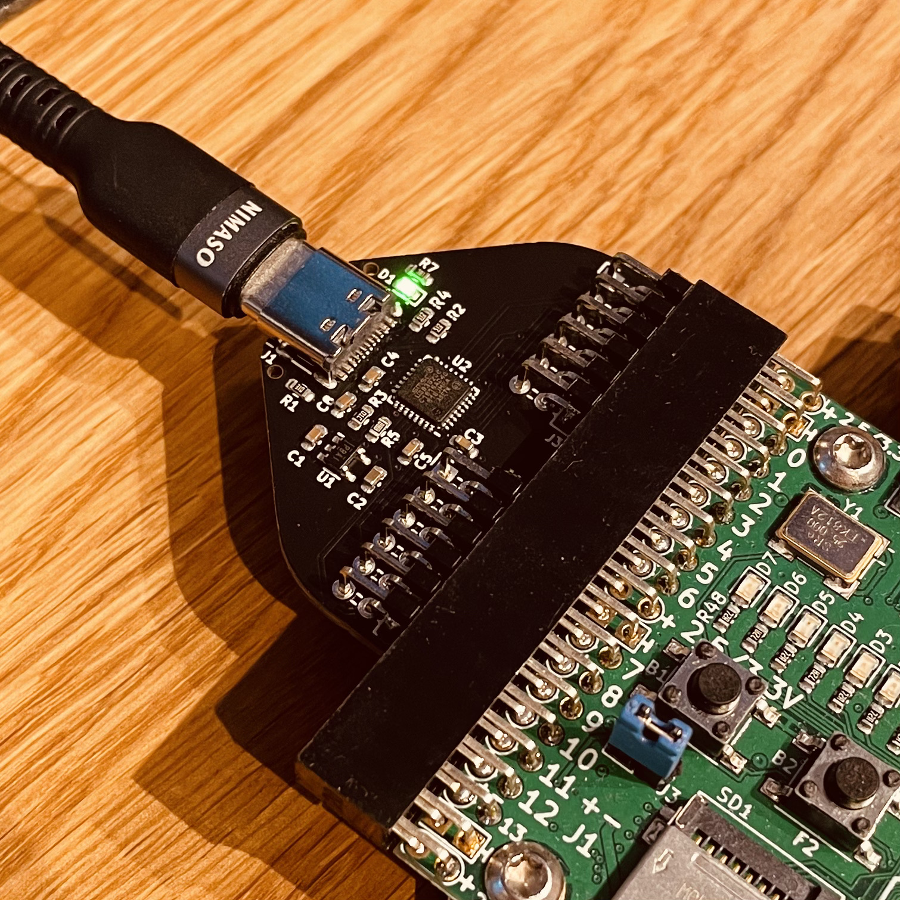

Pmod™ Compatible USB ULPI PHY
===

[![CC BY-SA 4.0][cc-by-sa-shield]][cc-by-sa]

This work is licensed under a [Creative Commons Attribution-NonCommercial-ShareAlike 4.0 International License][cc-by-sa].

[![CC BY-SA 4.0][cc-by-sa-image]][cc-by-sa]

[cc-by-sa]: http://creativecommons.org/licenses/by-nc-sa/4.0/
[cc-by-sa-image]: https://licensebuttons.net/l/by-nc-sa/4.0/88x31.png
[cc-by-sa-shield]: https://img.shields.io/badge/License-CC%20BY--NC--SA%204.0-lightgrey.svg

## Images

### JLCPCB

PCBs can be ordered fully-assembled (besides the pin header) from [JLCPCB](https://jlcpcb.com). Required files are
[PmodUsbUlpi_cpl_jlc.csv](PmodUsbUlpi_cpl_jlc.csv), [PmodUsbUlpi_bom_jlc.csv](PmodUsbUlpi_cpl_jlc.csv) and
[Gerber/PmodUsbUlpi.zip](Gerber/PmodUsbUlpi.zip).